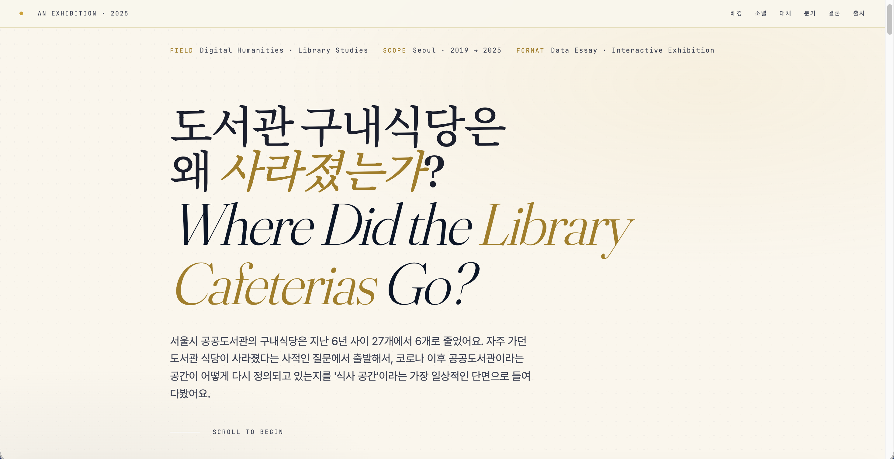
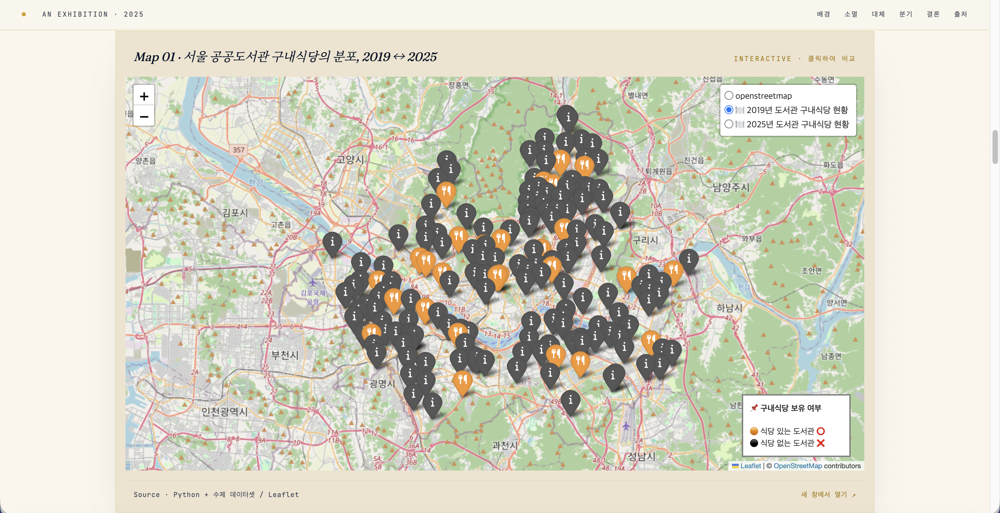
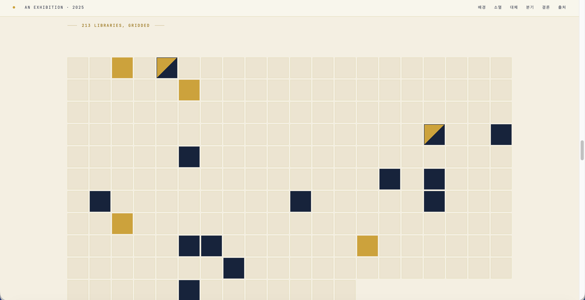

# 도서관 구내식당은 왜 사라졌는가?
### 서울시 공공도서관 구내식당의 변화, 2019 → 2025
##### Where Did the Library Cafeterias Go? · A Data Essay on Seoul's Public Libraries

> 자주 가던 공공도서관의 구내식당이 코로나 이후 사라졌다. 한 이용자의 사적인 질문에서 출발해, 서울시 공공도서관 편의시설의 변화를 데이터로 추적하고 인터랙티브 전시로 시각화한 디지털 인문학(DH) 프로젝트다.

🔗 **전시 보기 (Live Exhibition)**  https://pinakes-me.github.io/seoul-library-cafeteria-exhibition/

---

## 개요 · Overview

코로나19 전후로 서울시 공공도서관의 구내식당이 눈에 띄게 줄었다는 경험적 인상을, 공개 데이터와 직접 수집한 자료를 결합해 검증한 프로젝트다. 코로나 직전인 **2019년**과 최신 시점인 **2025년**을 비교해, 구내식당과 카페 등 편의시설의 변화를 전자지도와 차트로 시각화했다.

단순한 시설 현황 조사를 넘어, "공공도서관이라는 공간의 성격이 어떻게 재정의되고 있는가"라는 질문을 '식사 공간'이라는 일상적 단면을 통해 들여다보는 데 목적이 있다.

> 이 프로젝트는 개인의 공간 경험(qualitative observation)을 공공데이터와 수제 데이터셋(quantitative evidence)으로 교차 검증하는 디지털 인문학(Digital Humanities) 실험이기도 하다.

---

## 핵심 발견 · Key Findings

**1. 구내식당의 급감 (The Disappearance)**
서울시 공공도서관 수가 180개에서 213개로 늘어나는 동안, 구내식당은 **27개에서 6개로 감소**했다. 점유율로 보면 15.0%에서 2.8%로의 후퇴다.

**2. 밥 대신 커피 (The Replacement)**
2025년 기준 구내식당은 6개인 반면 카페는 13개로, 카페가 약 2.2배 많다. 다만 식당과 카페를 모두 합쳐도 전체 도서관의 8.9%에 불과하다.

**3. 운영 주체에 따른 분기 (The Divergence)**
같은 공공도서관이라도 운영 주체에 따라 편의시설 양상이 갈린다. 남은 구내식당 6개 중 4개(67%)가 교육청 소속인 반면, 카페 13개 중 11개(85%)는 자치구 소속이다.

---

## 스크린샷 · Screenshots

### 오프닝 · Hero


### 인터랙티브 지도 · Interactive Map


### 데이터 그리드 · Data Grid


---

## 방법론 · Methodology

### 데이터 수집 · Data Collection

| 구분 | 출처 | 내용 |
|------|------|------|
| 공식 통계 | 국가도서관통계시스템 | 공공도서관 전체 통계 |
| 공식 통계 | 서울시 열린데이터광장 | 서울시 공공도서관 현황·위치정보 |
| 수동 수집 | 네이버 블로그 외 | 편의시설(구내식당·카페) 보유 여부 |

공공도서관의 목록과 위·경도는 공식 데이터로 확보할 수 있었으나, **구내식당·카페 등 편의시설의 보유 여부는 공개 데이터가 존재하지 않았다.** 이 부분은 관련 정보를 수집한 블로거들의 기록과 직접 검색을 통해 수동으로 복원했다.

공식 데이터에 존재하지 않는 '구내식당·카페 보유 여부'를 시민 기록과 직접 조사로 복원했다는 점에서, 본 프로젝트는 단순 시각화를 넘어 **데이터 큐레이션(data curation)**의 성격을 가진다. 이 수제 데이터 가공 과정이 본 프로젝트의 핵심 작업이자 가장 큰 한계 지점이다.

### 처리 및 시각화 · Processing & Visualization

수집한 데이터에 `2019년/2025년 구내식당 보유 여부`, `2025년 카페 보유 여부`, `설립 주체`, `비고` 등의 컬럼을 추가해 CSV로 정리한 뒤, Python으로 전자지도와 차트를 생성했다.

- **Tools** — Python · Notion · 생성형 AI(ChatGPT, Gemini) 보조
- **Output** — 인터랙티브 전자지도(Leaflet), 비교 차트, 스크롤 기반 전시 사이트(HTML/CSS/JS)

---

## 범위와 한계 · Scope & Limitations

- **국립도서관 제외** — 구내식당으로 유명한 국회도서관·국립중앙도서관은 공식 분류상 '공공도서관'이 아닌 '국립도서관'이므로 분석에서 제외했다.
- **카페 데이터의 잠정성** — 카페 보유 여부 데이터는 2025년 시점에만 존재하며, 시민 관찰에 기반한 **잠정값**이다. 2019년 카페 데이터가 없어 시계열 비교는 구내식당에 한정된다.
- **수제 데이터의 불완전성** — 편의시설 정보는 공식 출처가 없어 누락·오류 가능성이 있다. 새로운 정보나 정정 사항은 언제든 환영한다.

> 한계를 감추기보다 명시하는 편이 데이터의 성격을 정직하게 전달한다고 보았다.

---

## 해석 · Interpretation

구내식당의 소멸은 단일 원인으로 설명되지 않는다. 코로나19 시기의 장기 휴관이 위탁 운영 갱신에 영향을 준 것을 출발점으로, 세 가지 흐름이 함께 작용한 것으로 추정한다.

- **패러다임의 전환** — '공부방'에서 '복합문화공간'으로. 끼니보다 휴식(카페)이 중시되는 변화.
- **경제성** — 인건비·물가 상승으로 저렴한 구내식당은 적자 구조. 카페는 적은 공간·인력으로 운영 가능.
- **상권 변화** — 도서관 주변 외식 인프라 발달로 내부 식사 수요 감소.

이 변화는 단순한 편의시설 재편이 아니라, 공공도서관이라는 공간이 누구를 위해 어떻게 머무르는 장소가 되고 있는지에 대한 사회적 재구성의 흔적으로도 읽을 수 있다.

---

## 프로젝트 구조 · Repository

```
.
└── index.html        # 인터랙티브 전시 사이트 (단일 파일)
```

전시 사이트에 임베드된 전자지도는 별도 레포지토리에서 배포된다.

---

## 만든이 · Digital Curator

**사적인북마크**
사서를 희망하는 사람. 디지털인문학과 문헌정보학의 교차점에서, 도서관 안팎의 비정형 데이터를 발굴하고 새로운 가치로 변환하는 데 관심이 많습니다.

🐦 Twitter [@pinakes_me](https://twitter.com/pinakes_me)

---

<sub>© 사적인북마크 · 2025 · 데이터 출처는 각 기관에 있으며, 수집·해석의 책임은 제작자에게 있습니다.</sub>
